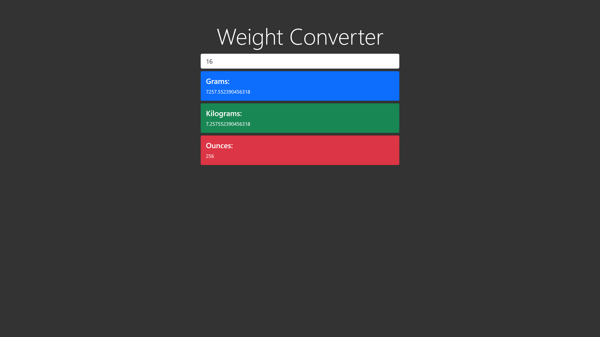

# Simple Weight Converter using Vanilla JS and Bootstrap 5

## Table of contents

- [Overview](#overview)
  - [About](#About)
  - [Screenshot](#screenshot)
  - [Links](#links)
- [My process](#my-process)
  - [Built with](#built-with)
  - [What I learned](#what-i-learned)
- [Author](#author)


## Overview

### About

Users should be able to enter weight in pounds and should be able to see the equivalent weight in grams, kilograms and ounces.


### Screenshot




### Links

- Solution URL: [Add solution URL here](https://your-solution-url.com)
- Live Site URL: [Add live site URL here](https://your-live-site-url.com)

## My process

### Built with

- Semantic HTML5 markup
- CSS custom properties
- JavaScript
- Bootstrap 5
- Mobile-first workflow


### What I learned

I learned to use bootstrap 5 along with several JavaScript event listeners and DOM manipulation.

```js
document.getElementById('lbsInput').addEventListener('input', (e) => {
    document.getElementById('output').style.visibility = 'visible';
    let lbs = e.target.value;
    document.getElementById('gramsOutput').innerHTML=lbs/0.0022046;
    document.getElementById('kgOutput').innerHTML=lbs/2.2046;
    document.getElementById('ouncesOutput').innerHTML=lbs*16;
})
```

## Author

- Live Project - [Weight Converter](https://www.your-site.com)
- GitHub -  [Amogh Nandodkar](https://github.com/NandodkarAmogh)

